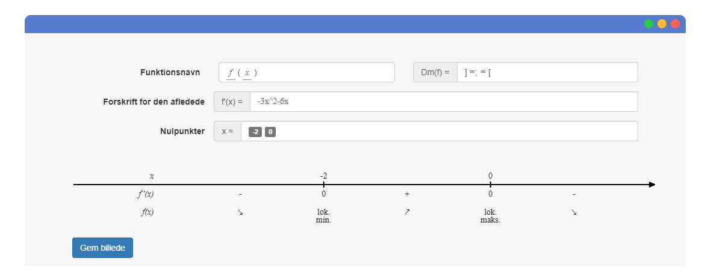

# Monotonimaker

Et simpelt lille program til at hjælpe med at lave en monotonilinje.


## Installation

Monotonimaker er bygget [Node.js](https://nodejs.org/) og [Electron](https://www.electronjs.org/).

For at køre Monotonimaker så skal man hente repo'et også installere de forskellige moduler.

```sh
$ npm install 
$ npm start
```

Køre man Windows så kan man også hente installeren og installere det som et normal program.

| OS | Installer |
| ------ | ------ |
| Windows | [Dropbox](https://www.dropbox.com/s/sa0msu3rzi1m7u2/monotonimaker.zip?dl=0) |

Ønskes det at bygge installeren selv:

```sh
$ npm install 
$ npm run dist
```
Også vil installations filerne være i mappen "Dist"
